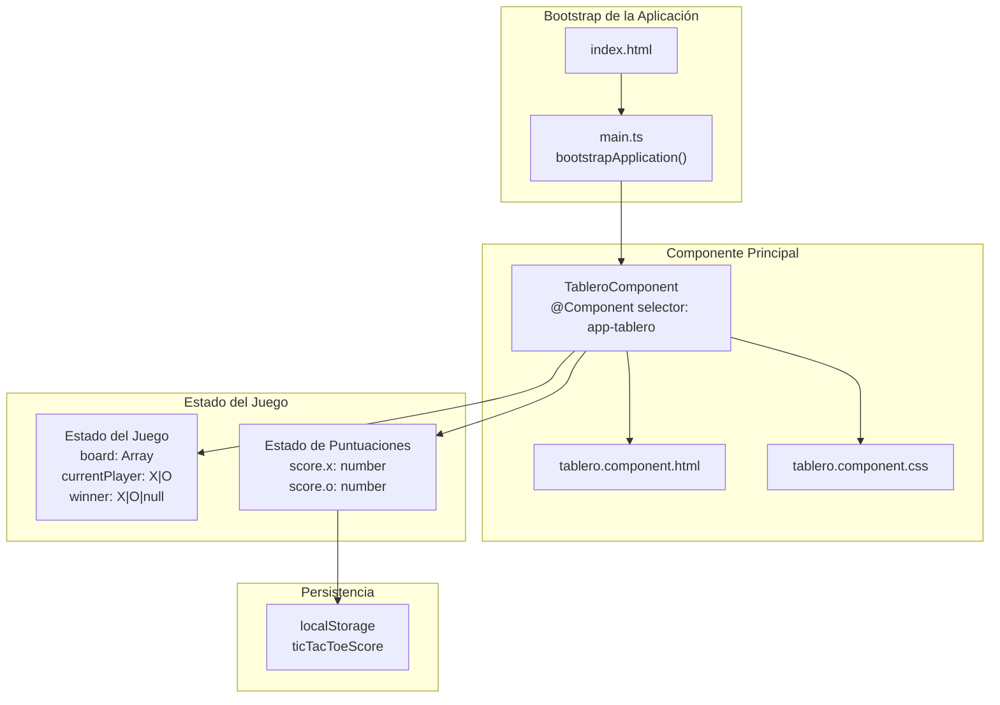
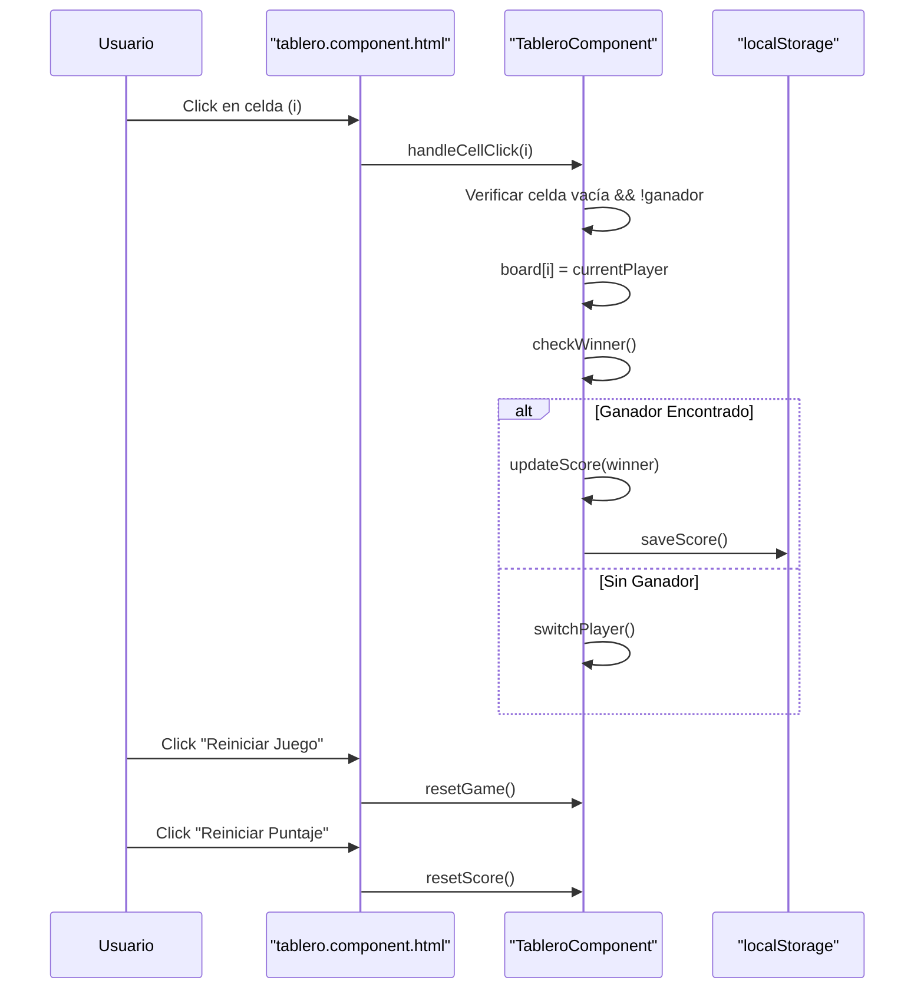

# tresenraya

Una aplicación web de Tres en Raya (Tic-Tac-Toe) desarrollada con Angular 18, que incluye persistencia de puntuaciones y diseño responsivo con Tailwind CSS.

## 🎯 Características

- **Juego clásico de Tres en Raya** con tablero 3x3
- **Persistencia de puntuaciones** usando localStorage
- **Interfaz responsiva** con Tailwind CSS
- **Detección automática de ganador**
- **Alternancia automática de jugadores** (X y O)
- **Reinicio de juego y puntuaciones**

## 🛠️ Stack Tecnológico

| Tecnología | Versión | Propósito |
|------------|---------|-----------|
| Angular | 18.2.0 | Framework frontend |
| TypeScript | 5.5.2 | Desarrollo type-safe |
| Tailwind CSS | 3.4.11 | Framework CSS utility-first |
| RxJS | 7.8.0 | Programación reactiva |
| Karma + Jasmine | 6.4.0 + 5.2.0 | Testing |

## 🏗️ Arquitectura de la Aplicación



## 🚀 Instalación y Ejecución

### Prerrequisitos
- Node.js (versión 18 o superior)
- npm o yarn

### Comandos disponibles 

```bash
# Instalar dependencias
npm install

# Ejecutar en modo desarrollo
npm start

# Construir para producción
npm run build

# Ejecutar tests
npm test

# Construir en modo watch
npm run watch
```

## 📁 Estructura del Proyecto

```
src/
├── app/
│   └── tablero/
│       ├── tablero.component.ts    # Lógica del componente
│       ├── tablero.component.html  # Template del UI
│       ├── tablero.component.css   # Estilos del componente
│       └── tablero.component.spec.ts # Tests unitarios
├── index.html                      # Punto de entrada HTML
├── main.ts                         # Bootstrap de Angular
└── styles.css                      # Estilos globales
```

## 🎮 Funcionalidad del Juego

### Flujo de Interacción del Usuario



### Gestión del Estado

El componente `TableroComponent` maneja cuatro propiedades principales de estado:

- **`board`**: Array de 9 elementos que representa el tablero 3x3
- **`currentPlayer`**: Jugador actual ('X' o 'O')
- **`winner`**: Ganador del juego actual (null si no hay ganador)
- **`score`**: Objeto con las puntuaciones de ambos jugadores

### Algoritmo de Detección de Ganador

El juego implementa las 8 combinaciones ganadoras estándar del tres en raya:
- 3 filas horizontales: [0,1,2], [3,4,5], [6,7,8]
- 3 columnas verticales: [0,3,6], [1,4,7], [2,5,8]
- 2 diagonales: [0,4,8], [2,4,6]

## 🎨 Interfaz de Usuario

### Estructura del Template 

La interfaz incluye:
- **Tablero de juego**: Grid 3x3 con celdas interactivas
- **Panel de controles**: Botones para reiniciar juego y puntuaciones
- **Contador de victorias**: Muestra las puntuaciones de X y O
- **Diseño responsivo**: Adaptable a diferentes tamaños de pantalla

### Punto de Entrada 

La aplicación utiliza el patrón de componente standalone de Angular, bootstrapeando directamente `TableroComponent` sin necesidad de un módulo raíz.

## 💾 Persistencia de Datos

Las puntuaciones se guardan automáticamente en `localStorage` con la clave `'ticTacToeScore'`, permitiendo que los puntajes persistan entre sesiones del navegador.

## 🧪 Testing

El proyecto incluye configuración para testing unitario con Karma y Jasmine. Los tests se pueden ejecutar con `npm test`.

## 📄 Licencia

Proyecto privado según la configuración en `package.json`.
